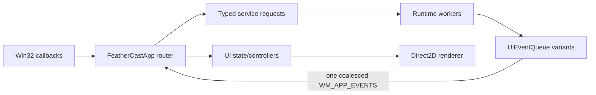

# FeatherCast Architecture

FeatherCast is a Windows-native C++23 launcher. The executable is split into a
Win32 composition root, a runtime library, and a UI library. Existing settings,
SQLite data, plugin ABI versions, paths, shortcuts, window identities, and
single-instance behavior remain compatibility boundaries.

## Ownership

`FeatherCastApp` owns HWND creation, the UI message loop, global shortcut and
tray registration, service lifetime, and routing. It is the only component that
may mutate live window state.

`FeatherCastRuntime` owns application models and background work:

- `PersistenceService` serializes settings and SQLite work and drains writes at
  orderly shutdown.
- `DiscoveryService` coalesces refreshes and suppresses stale generations.
- `FileIndexService` owns recursive fixed-local-root crawling, one asynchronous
  `ReadDirectoryChangesW` watcher per root, burst coalescing, reconciliation,
  cancellation, and bounded retries. It emits typed batches/status only.
- `FileSearchService` owns the read-only WAL SQLite connection used for
  generation-safe `@files` FTS queries. Root search never calls FTS.
- `PreviewService` reads bounded metadata/text/image payloads on demand and
  suppresses stale generations. WIC decoding produces CPU pixels; Direct2D
  bitmap creation remains on the UI thread.
- `CaptureService` owns the native screenshot/recording worker. Screenshot
  preparation captures an immutable CPU draft with GDI; the UI editor keeps
  crop and annotation state on the UI thread, and finalization rasterizes the
  selected physical pixels before writing a PNG or publishing `CF_DIBV5` to the
  clipboard. Windows Graphics Capture and Media Foundation continue to produce
  silent H.264 MP4 recordings. It reports typed lifecycle events to the UI.
- `SearchCoordinator` coalesces queries; `SnapshotCoordinator` prepares
  immutable corpus snapshots by revision. `search_pipeline::ComputeResults`
  is the pure query-to-sections engine shared by the app and headless tests.
- `LaunchService`, `IconResolver`, `CurrencyService`, and `UpdateService` own
  their workers and cancellation. WinHTTP implementation details live in the
  runtime network adapter.
- Command and setting descriptor catalogs provide stable IDs, labels,
  availability metadata, focus order, and confirmation policy.
- The Library model owns snippet/quicklink validation and ordering. Snippet I/O
  preserves the existing JSON format, performs atomic replacement, and detects
  external file changes. The native manager/editor UI lives outside the Win32
  composition root and reports successful mutations back as typed operations.
- The capability catalog describes built-in feature discovery, examples, and
  typed guide actions without changing search-provider or plugin contracts.
- Result actions carry a typed app, window, or text payload. Window geometry,
  local clock answers, UUID formatting, and Windows Settings targets stay in
  narrow deterministic helpers outside the Win32 composition root.

`FeatherCastUi` owns UI-thread-only overlay/settings state and controllers. UI
state transitions and descriptor projections are pure and unit tested. Direct2D
resources are render-target-bound and must never be touched by runtime workers.
The screenshot editor, region selector, and capture-excluded recording controls
remain UI-thread windows; only physical-pixel bounds, immutable drafts, and
typed capture requests cross to the worker. Drafts are never backed by a file
or clipboard entry before explicit screenshot finalization.
`FeatherCastApp` retains reference aliases for legacy rendering and routing code,
but the referenced values live exclusively in `OverlayState` and
`SettingsState`; new interaction state must be added to those production models.

## Thread Affinity and Event Flow

Workers receive value requests and return immutable payloads. They never call
the app or access mutable UI state. `UiEventQueue::Push` is thread-safe and posts
at most one outstanding notification. Only the UI thread calls `Drain` and
applies current-generation results. Events pushed after queue closure are
rejected.

## Shutdown

Shutdown is idempotent and ordered:

1. Mark the app as stopping so notifiers stop posting window messages.
2. Stop launch, discovery, file-index watchers, preview, file-search, search,
   snapshot, currency, update, extension, and icon workers; each service
   requests cancellation and joins its threads.
3. Drain serialized persistence work and close the database. The read-only FTS
   connection always closes before the persistence writer.
4. Close event queues so late producer results are rejected.
5. Release render resources, hooks, tray state, and windows on the UI thread.

No worker may outlive a service, and no service callback may target a destroyed
window.

## Persistence Compatibility

- `%APPDATA%\FeatherCast`: settings, snippets, themes, and user plugins.
- `%LOCALAPPDATA%\FeatherCast`: SQLite operational data, icon cache, updates,
  currency cache, and diagnostics.
- Settings JSON writes `"schemaVersion": 2`. A missing version is version 0.
  Files newer than the supported version are preserved and automatic saving is
  blocked.
- SQLite schema v4 adds clipboard pins and saved timer/stopwatch state, with a
  transactional migration and a `.pre-v4.bak` backup. Schema v3 gives indexed files stable IDs and uses an FTS5
  `contentless_delete` table whose row IDs match file IDs. Migration creates a
  database backup because clipboard data shares the file. SQLite uses WAL,
  busy timeouts, integrity checks, and corrupt database quarantine. Clipboard
  text and previews remain protected with user-scoped Windows DPAPI.
- Native plugin ABI v1/v2 and plugin-host isolation remain unchanged.
- Plugin health exposes availability, consecutive failure strikes, and the last
  in-memory error without changing plugin manifests or the ABI.

## Change Rules

New services expose explicit start/stop and typed request methods. New ordinary
commands and settings belong in the descriptor catalogs. Platform operations
use narrow adapters or callbacks; no dependency-injection framework is needed.
Feature work must preserve external behavior unless a separate change explicitly
updates the compatibility contract.
